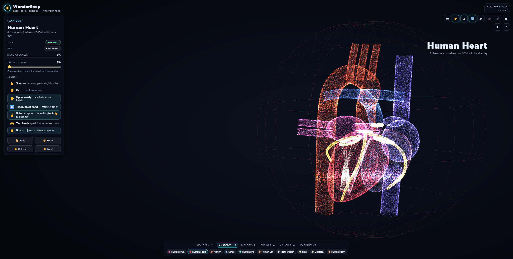

# AETHER

**Adaptive Engine for Thinking, Holograms, Experiments & Reasoning: a holographic workshop run by a team of AI agents,
with 3D models made of up to 250,000 glowing particles that you control with your hands and your voice.**

Snap your fingers in front of your webcam and up to 250,000 GPU particles swirl into existence. Make a fist and they
form the Eiffel Tower, a beating heart or a V8 engine. Open your hand and the model morphs into the next one, or
explodes into a labelled diagram of every part. No mouse, no controller, no install beyond Node.js.



## Quick start

You need [Node.js](https://nodejs.org/) 18 or newer and a webcam (optional: everything also works with the mouse and
keyboard).

```bash
git clone https://github.com/AkbarSheikh-debug/wondersnap.git
cd wondersnap
npm install
npm start
```

Then open **http://localhost:5173** in Chrome or Edge and click **Start with camera**, or **Continue without camera**
to drive it with the on-screen buttons and keyboard.

> The browser only allows camera access on `localhost` or `https`, which is why the app comes with its own tiny
> local server. To use a different port: `npm start -- 8080`.

## The AI: AETHER and its agents

You talk to **AETHER** (say *"Aether, …"* with 🎤 on, or press `J` and type). Its **Core** works out what you want
and hands the work to four specialist agents, which run **in parallel**:

| Agent | Does | Tools |
|---|---|---|
| 🔵 **Hologram** | Drives the display | show model, explode, highlight part, zoom, rotate (360°), cut-away, quiz, repulsor |
| 🟣 **Knowledge** | Explains things | the parts on screen, plus live Wikipedia search and summaries |
| 🟢 **World** | Live facts | weather and local time anywhere ([open-meteo](https://open-meteo.com), no key) |
| 🟠 **Systems** | The machine itself | diagnostics, camera, recording, microphone |

Each agent has its own **dot** in the console. It pulses while thinking, spins while it runs a tool, and shows a check
when done. Busy agents also orbit the hologram. Every run gets a live **task card** listing its tool steps (click it to
see the agent's report). Try *"Aether, show me the helmet and explain what the faceplate does"* and watch the Hologram
and Knowledge agents work at the same time. You can also send a task to one agent directly: click its dot, or type
`@world weather in Paris`.

A clear single-agent request ("explode it", "weather in Tokyo") skips the Core's planning step and goes straight to the
right agent, which saves one model call. Say *"call me Boss"* and AETHER will address you that way, or open the app with
`?address=sir`.

**Turn on the AI brain (free):**

1. Get a key at [openrouter.ai/keys](https://openrouter.ai/keys).
2. Copy `.env.example` to `.env` and set `OPENROUTER_API_KEY=...` (`OPEN_ROUTER_KEY` also works).
3. Restart the server with `npm start`. The console says `brain: OpenRouter`.

By default the server picks OpenRouter's **free** models that support tool calling, and moves on to the next one if a
model is rate-limited. To choose models yourself, set `OPENROUTER_MODEL=model-a,model-b`. The key stays on the server
and is never sent to the browser, and only `localhost` may use it unless you set `AETHER_ALLOW_LAN=1`.

**Without a key**, the same agents run on *local protocols*: keyword hologram commands, weather, world clocks,
Wikipedia summaries, diagnostics and small talk all still work.

## Hologram and 360° view

- **Realistic hologram:** near particles are bright and sharp, far ones dim and soft. You also get per-particle
  shimmer, a scan band sweeping up the model, projector interference lines, rare white sparks, a globe whose far side
  fades, and a holo-projector light cone. Add `?holo=0` for the plain glow.
- **360° view:** drag in any direction to turn the model all the way around, including over the top and underneath.
  The globe turns with it, and a readout shows the yaw and pitch. Press `Y` (or 🌐) for an automatic 360° orbit, and
  double-click to reset. AETHER can do it too: *"turn it upside down"*.

## How it works

| Layer | What it does |
|---|---|
| **Hand tracking** | [MediaPipe Hand Landmarker](https://ai.google.dev/edge/mediapipe/solutions/vision/hand_landmarker) tracks up to two hands (21 landmarks each) from the webcam, fully on-device |
| **Gesture recognition** | Custom classifiers turn landmarks into poses (fist, open, point, pinch, peace), a finger-snap detector, hand twist/tilt and two-hand zoom, fed through a debouncer and a state machine |
| **Particle engine** | A hand-written WebGL2 renderer. Particle physics runs on the GPU with transform feedback: no Three.js, no game engine, no framework |
| **Models** | 37 procedural models built from real measurements and sampled into point clouds, with named parts that can explode, glow and be pulled out |
| **Server** | A zero-dependency Node.js static server (`server.mjs`) |

Nothing is sent anywhere: the video never leaves your machine.

## Gestures

| Gesture | What it does |
|---|---|
| 🫰 **Snap** | Summon the particles, or dissolve the current model |
| ✊ **Fist** | Form the wonder, organ or machine |
| ✋ **Open hand** | Wonders morph to the next one. Organs, engines and vehicles **explode**: how far you open your hand sets how far the parts fly apart, and closing it puts them back together |
| 🔄 **Twist / raise your hand** | Turn and tilt the formed model |
| ☝️ **Point** | Hold your finger on a part to select it. It glows, and a card explains what it does |
| 🤏 **Pinch** | Pull the selected part out toward you; pinch again to put it back |
| 🙌 **Two hands** | Move them apart or together to zoom |
| ✌️ **Peace** | Jump to the next model |

## Keyboard and mouse

| Key | Action |
|---|---|
| `Space` | Snap |
| `F` / `O` / `V` | Fist / open hand / peace sign |
| `←` `→` | Previous / next model |
| `E`, `↑` `↓`, mouse wheel | Explode amount |
| `+` `-` `0`, ctrl + wheel | Zoom |
| `C` | Camera on/off |
| `L` | Part labels |
| `R` | Auto-rotate |
| `G` | Hand rotation on/off |
| `X` | Cut-away cross-section (`,` and `.` nudge the plane) |
| `Q` | Quiz mode |
| `M` | Voice commands and read-aloud |
| `K` | Record a video |
| `D` | Play the demo |
| `Y` | 360° orbit |
| `J` | Talk to AETHER (type) |
| `I` / `Esc` | Describe / deselect the selected part |
| `H` | Help |

Click a part to select it. Drag in any direction for the 360° view; double-click resets it.

## Features

- **Beating heart and breathing lungs.** The heart contracts in a lub-dub rhythm at 72 bpm, the lungs inflate every
  4.5 s, and pulses of light travel through them like blood or air.
- **Exploded views with named parts.** Every part has a leader-line label saying what it does.
- **Quiz mode.** "Find: Hippocampus": point at (or click) the right part. Five questions, with a score.
- **Voice control.** Say "show me the heart", "open it up", "where is the right atrium", "zoom in", "quiz" and more.
  Parts are read aloud with speech synthesis (Chrome or Edge).
- **Cut-away.** A cutting plane follows your hand and reveals a glowing cross-section.
- **Recording.** Save a WebM video of the scene.

## Models

| Category | Models |
|---|---|
| **Wonders (11)** | Turtle Tower, Eiffel Tower, Statue of Liberty, Burj Khalifa, Great Pyramid, Colosseum, Leaning Tower of Pisa, Taj Mahal, Big Ben, Christ the Redeemer, Sydney Opera House |
| **Anatomy (10)** | Brain, beating Heart, Kidney, breathing Lungs, Eye, Ear, Tooth, Skull, Skeleton, Human Body (skin, organs, nerves, arteries, veins, skeleton) |
| **Biology (2)** | DNA double helix that unzips, Animal cell |
| **Engines (4)** | Inline-4, Supercharged HEMI V8, Turbofan jet, 9-cylinder radial |
| **Vehicles (5)** | Sports car, Motorcycle, Airliner, Saturn V (with stage separation), Royal Enfield Classic 350 in Medallion Bronze |
| **Machines (2)** | Mechanical wristwatch, EV battery pack (280 cells, busbars, cooling, BMS) |
| **Stark Industries (3)** | Arc Reactor, Iron Man Helmet (Mark III), Repulsor Gauntlet |

## URL options

| Option | Effect |
|---|---|
| `?n=250000` | Particle count |
| `?model=12` | Start on a given model |
| `?autostart=camera` / `?autostart=nocamera` | Skip the start screen |
| `?trails=0` | Turn off particle trails |
| `?dpr=1` | Force the device pixel ratio (useful on slower GPUs) |
| `?holo=0` | Plain particle glow instead of the hologram look |
| `?address=sir` | What AETHER calls you |

## Tests

45 end-to-end and unit tests with [Playwright](https://playwright.dev/), driving the real app with synthetic hands on
a deterministic clock.

```bash
npx playwright install chromium   # one time
npm test
```

| Spec | Covers |
|---|---|
| `app.spec.js` | The full gesture story, every model, explode/contract, keyboard, wheel, tabs, demo, phone layout, hand twist and tilt |
| `features.spec.js` | Heartbeat and breathing, two-hand zoom, point-to-pick, pinch-to-pull, quiz, voice commands, cut-away, video recording |
| `camera.spec.js` | Real `getUserMedia` to MediaPipe on Chromium's fake webcam, plus the camera-denied fallback |
| `gpu.spec.js` | The GPU physics shader matches its CPU twin to ~1e-7 in every mode |
| `logic.spec.js` | Pose classifiers, snap detector, debouncer, state machine, controller, voice-command parser |
| `models.spec.js` | Every model is deterministic, finite and fast, with real measurements and correctly exploding parts |
| `aether.spec.js` | Wake word and agent router, parallel agents with dots and task cards, `@agent` tasks, Core-to-specialist delegation against a mocked OpenRouter, error fallback, repulsor, Royal Enfield and the 360° view |

## Project structure

```
index.html, styles.css     page and styles
server.mjs                 zero-dependency static server + OpenRouter proxy for AETHER
models/                    MediaPipe hand landmark model
src/app.js                 render loop, explode, zoom, picking, quiz, cut-away, HUD, labels, demo
src/hands.js               webcam + MediaPipe Hand Landmarker
src/aether.js              AETHER: wake word, Core orchestrator, parallel agent tool loops, local brain, weather, Wikipedia, sfx
src/agents.js              the agents: roles, tools, prompts and the fast keyword router
src/features.js            voice commands, read-aloud, video recorder
src/gl/                    WebGL2 shaders and renderer (transform-feedback physics)
src/logic/                 gestures, state machine, controller, CPU physics twin
src/lib/                   vector math, samplers, procedural shapes
src/models/                wonders, anatomy, biology, engines, vehicles, machines, stark (arc reactor, helmet, gauntlet), enfield (Classic 350)
tests/                     Playwright specs
```

## Troubleshooting

- **Camera doesn't start:** open the app via `http://localhost:5173`, not by double-clicking `index.html`, and allow
  camera access when the browser asks.
- **Hand tracking never loads:** run `npm install` first; the tracking runtime is served from `node_modules`.
- **Low frame rate:** try `http://localhost:5173/?n=100000&dpr=1`.
- **AETHER says "local protocols":** check `.env` has `OPENROUTER_API_KEY` and restart. Free models are
  sometimes rate-limited; he then tries the next one and falls back to local protocols for that answer.
- **No British voice:** the app uses whatever `en-GB` voice your OS provides (on Windows, "Microsoft Ryan" or "George";
  on Chrome, "Google UK English Male").
- **Port already in use:** `npm start -- 8080` and open `http://localhost:8080`.

## License

[MIT](LICENSE) © 2026 Akbar Sheikh
