<div align="center">

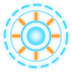

# AETHER

### Adaptive Engine for Thinking, Holograms, Experiments & Reasoning

**A holographic AI workshop in your browser. Up to 250,000 light particles form 3D models that you control with your
hands and your voice. A team of AI agents works in parallel to show, explain and look things up for you.**

[](LICENSE)
[](https://nodejs.org)
[](#-how-it-works)
[](https://ai.google.dev/edge/mediapipe/solutions/vision/hand_landmarker)
[](https://openrouter.ai)
[](#-testing)
[](package.json)
[](https://aether-psi-seven-78.vercel.app)

### [🌐 **Try it live: aether-psi-seven-78.vercel.app**](https://aether-psi-seven-78.vercel.app)

[**Quick start**](#-quick-start) · [**Deploy**](#%EF%B8%8F-deploy-your-own) · [**Features**](#-features) · [**AI agents**](#-the-ai-agents) · [**Gestures**](#%EF%B8%8F-gestures) · [**How it works**](#-how-it-works) · [**Roadmap**](#%EF%B8%8F-roadmap)

<br>

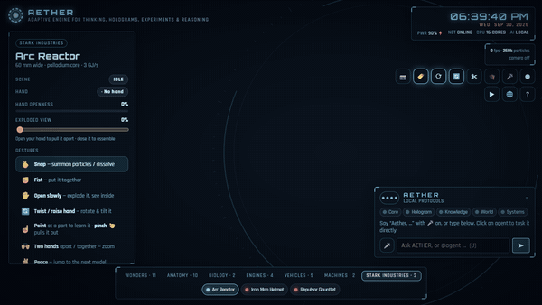

<sub>▶ <a href="docs/media/demo.mp4"><b>Watch the full demo in HD (MP4, 26 s)</b></a> · rendered frame by frame from the real app with <code>npm run capture</code></sub>

</div>

<br>

> **Snap** your fingers and a quarter-million particles swirl into a glowing sphere. **Make a fist** and they form an
> arc reactor, a Royal Enfield or a beating heart. **Open your hand** and it explodes into a labelled diagram of every
> part. Then just ask: *"Aether, show me the helmet, explain the faceplate and check the weather in Chennai."*
> Three agents go to work at once.

<br>

<table>
  <tr>
    <td width="50%">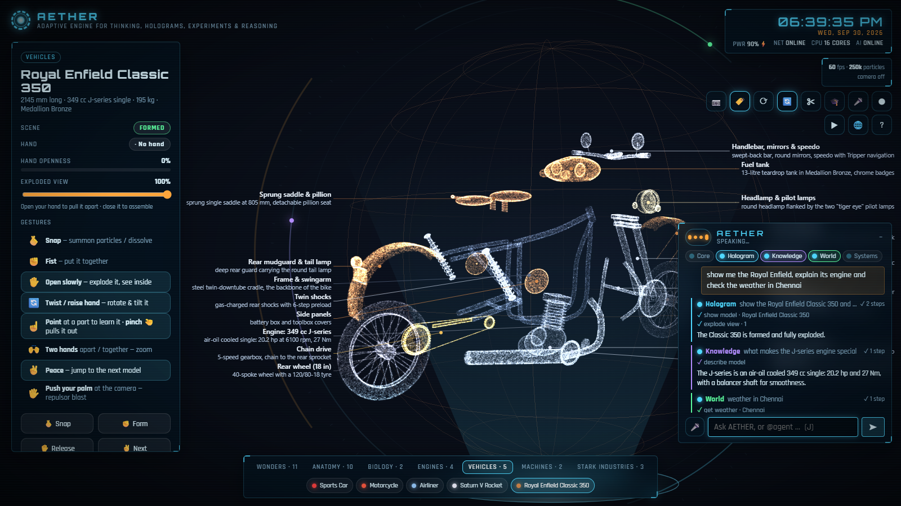</td>
    <td width="50%">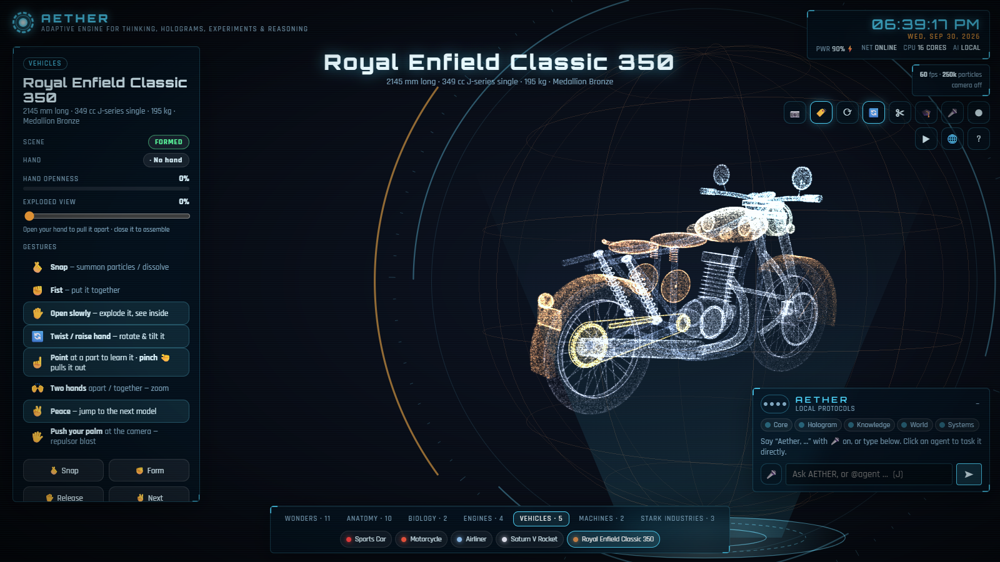</td>
  </tr>
  <tr>
    <td align="center"><b>Parallel AI agents</b>: the Core delegates, each agent runs its own tools</td>
    <td align="center"><b>Royal Enfield Classic 350</b> in Medallion Bronze, to real dimensions</td>
  </tr>
</table>

## 📑 Contents

- [Features](#-features)
- [Quick start](#-quick-start)
- [The AI agents](#-the-ai-agents)
- [Gestures](#%EF%B8%8F-gestures) · [Voice](#%EF%B8%8F-voice) · [Keyboard & mouse](#%EF%B8%8F-keyboard--mouse)
- [Models](#%EF%B8%8F-models)
- [How it works](#-how-it-works)
- [Deploy your own](#%EF%B8%8F-deploy-your-own) · [Configuration](#%EF%B8%8F-configuration)
- [Testing](#-testing)
- [Project structure](#-project-structure)
- [Roadmap](#%EF%B8%8F-roadmap) · [Contributing](#-contributing) · [FAQ & troubleshooting](#-faq--troubleshooting)

## ✨ Features

| | |
|---|---|
| 🤖 **Multi-agent AI** | A Core orchestrator hands work to **Hologram**, **Knowledge**, **World** and **Systems** agents that run **in parallel**, each with its own tools and live task card |
| 🖐️ **Hand control** | Snap, fist, open, twist, point, pinch, two-hand zoom, peace and a **repulsor palm push**, all tracked on-device by MediaPipe |
| 🌐 **360° view** | Drag in any direction to see every side, including top and bottom. Also an automatic orbit mode, a live yaw/pitch readout, and a globe that turns with the model |
| ✨ **Realistic hologram** | Depth-cued particles, per-particle shimmer, a sweeping scan band, projector interference lines, sparks and a holo-projector light cone |
| 💥 **Exploded views** | Hand openness sets how far parts fly apart. Every part is labelled with what it does |
| 🏍️ **37 models** | Wonders, anatomy (beating heart, breathing lungs), engines, vehicles, the **Royal Enfield Classic 350**, and a **Stark Industries** collection |
| 🎙️ **Voice** | Wake word *"Aether"*, a British read-aloud voice, follow-up questions without the wake word, and `@agent` direct tasks |
| 🆓 **Free AI brain** | OpenRouter's free tool-calling models are picked automatically, with fallback if one is rate-limited. The key stays on the server |
| 📴 **Works offline** | Without a key, the same agents run on local rules: commands, weather, world clocks, Wikipedia, diagnostics |
| 🎓 **Learn by doing** | Point-to-inspect, pinch-to-pull, quiz mode, cut-away cross-sections, video recording |
| 🔒 **Private** | The video never leaves your machine. The API is loopback-only by default, and `.env` is never served |
| 🧪 **Tested** | 45 Playwright tests run the real app on a deterministic clock, including the agent loop against a mocked LLM |

<details>
<summary><b>📸 More screenshots</b></summary>
<br>

| | |
|---|---|
| 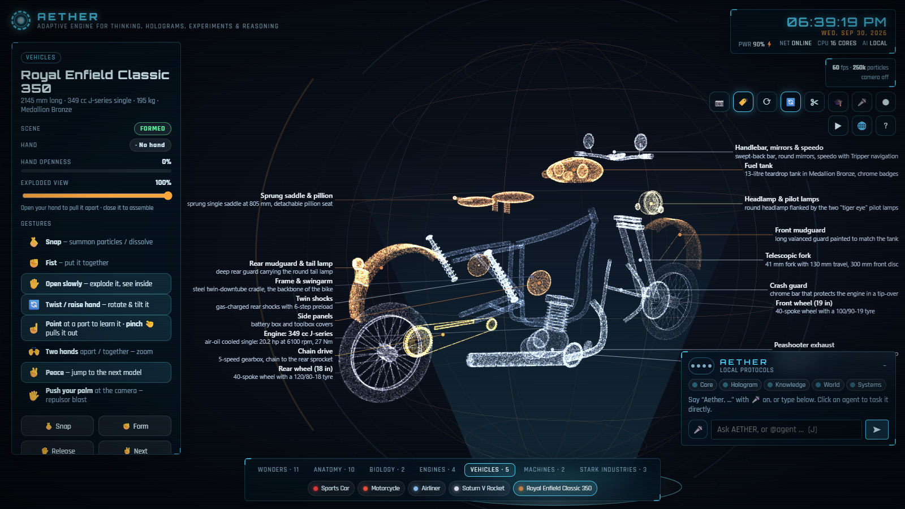 | 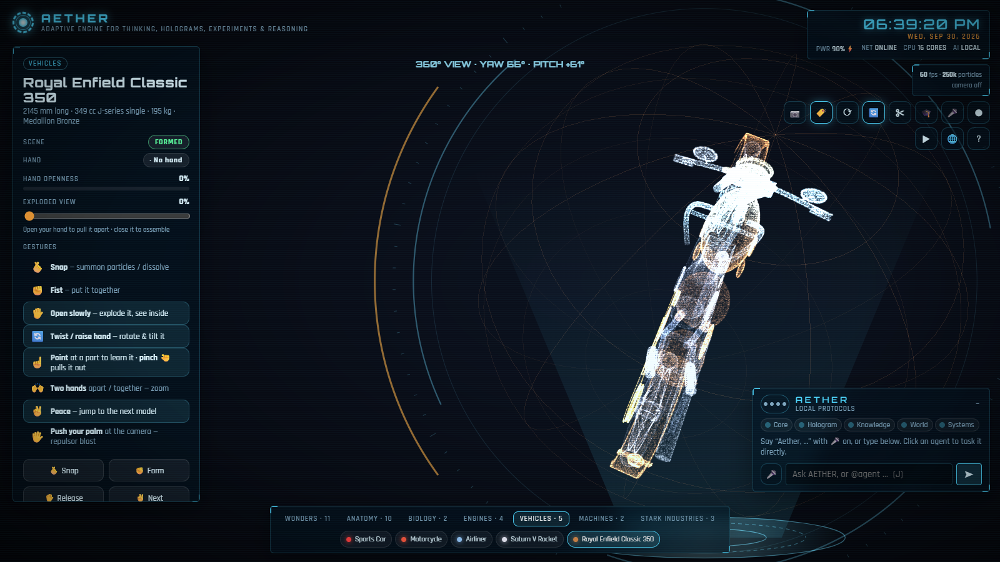 |
| **Exploded view**: 17 labelled parts, from the J-series engine to the tiger-eye pilot lamps | **360° view**: looking over the top, with the live yaw/pitch readout |
| 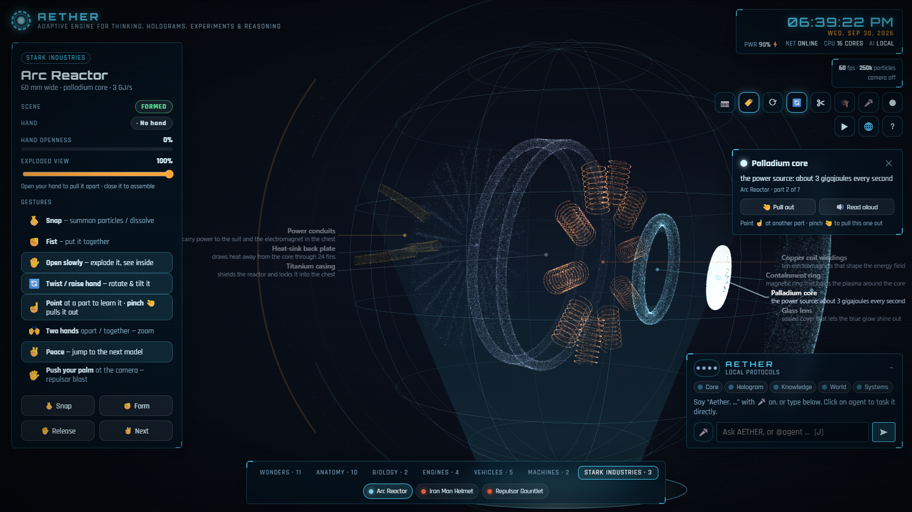 | 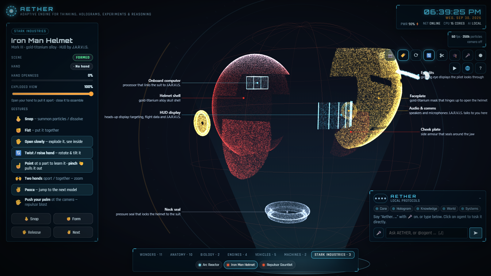 |
| **Arc Reactor** with the palladium core selected | **Mark III helmet**: faceplate, HUD, shell, cheek plates |
| 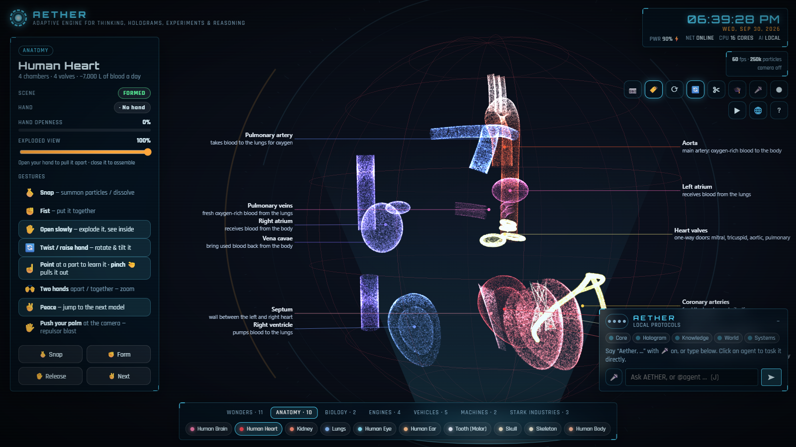 | 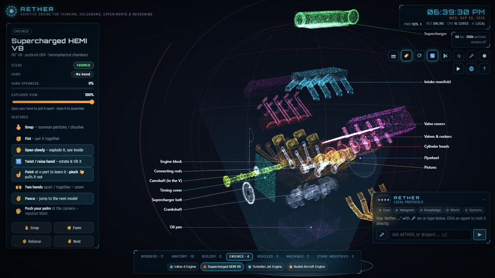 |
| **Human heart**: beats at 72 bpm, with blood-flow pulses | **Supercharged HEMI V8** |
| 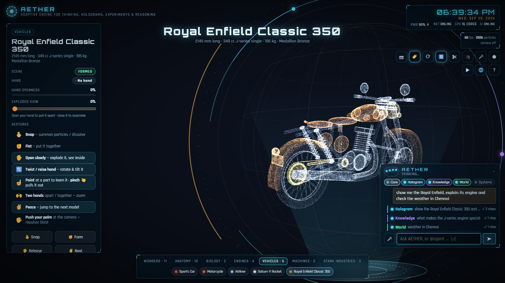 | 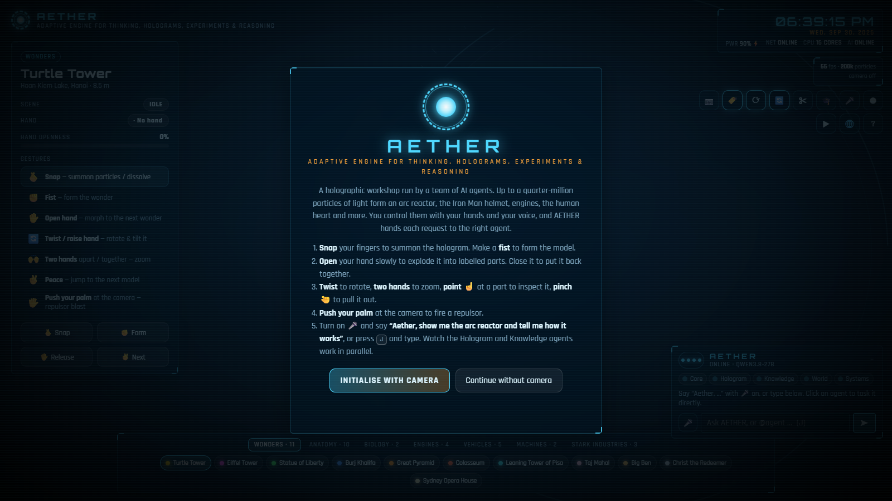 |
| **Agents mid-task**: every tool step appears as it runs | **Start screen** |

</details>

## 🚀 Quick start

**Requirements:** [Node.js](https://nodejs.org/) 18+ and Chrome or Edge. A webcam is optional: everything also works
with the mouse, keyboard and voice.

```bash
git clone https://github.com/sreekanthpogula/AETHER.git
cd AETHER
npm install
npm start
```

Open **http://localhost:5173**, then click **Initialise with camera** or **Continue without camera**.

### Turn on the AI brain (free, 1 minute)

```bash
cp .env.example .env        # then set OPENROUTER_API_KEY=sk-or-...   (get one free at https://openrouter.ai/keys)
npm start                   # the console prints:  brain: OpenRouter
```

Press <kbd>J</kbd> and type, or press <kbd>M</kbd> and say:

> *"Aether, show me the Royal Enfield and open it up"*
> *"Aether, what does the palladium core do?"*
> *"Aether, what's the weather in Tokyo, and what time is it there?"*
> *"Aether, turn it upside down"*

> [!TIP]
> No key? AETHER still runs on **local protocols**. Try *"show me the heart and tell me the time"* and watch the
> Hologram and World agents work in parallel.

## 🤖 The AI agents

AETHER isn't a single chatbot. It's a **Core orchestrator** with four specialists. A fast keyword router sends clear,
single-agent requests straight to the right specialist, which saves a model call. Anything else is planned by the Core,
which can delegate to several agents **at once**.

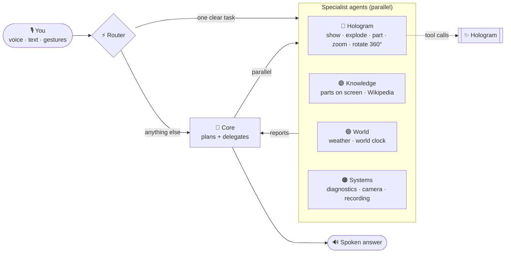

| Agent | What it does | Tools |
|---|---|---|
| 🧠 **Core** | Understands the request, plans, delegates, combines the reports | `delegate` |
| 🔵 **Hologram** | Drives the display | `show_model` `change_model` `explode_view` `select_part` `hologram` `zoom` `rotate_view` `set_display` `fire_repulsor` |
| 🟣 **Knowledge** | Explains how things work | `describe_model` `wiki_search` `wiki_summary` |
| 🟢 **World** | Live facts about the world | `get_weather` `world_clock` (open-meteo, no key) |
| 🟠 **Systems** | The machine itself | `system_status` `set_device` |

**The agent dots.** Every agent has a dot in the console. It pulses while thinking, spins while it runs a tool, and
shows a check when done. Busy agents also **orbit the hologram**. Each run gets a **task card** listing its tool steps,
and you can click the card to read the agent's report. Click an agent's dot (or type `@world weather in Paris`) to task
it directly.

<details>
<summary><b>How the brain stays free, fast and safe</b></summary>
<br>

- **Free models, automatic fallback.** `server.mjs` lists OpenRouter's free models that support tool calling and ranks
  them. If one is rate-limited, it tries the next. Pin your own with `OPENROUTER_MODEL=a,b,c`.
- **The key never reaches the browser.** The browser calls `/api/aether`, and the server adds the key. By default only
  `localhost` may use it (`AETHER_ALLOW_LAN=1` lets phones on your network in), and `.env` is never served.
- **Tools run in the browser.** Each agent's tool loop (up to 5 rounds) executes against the live app, so results are
  real. "Explode it" before the model has formed is queued, not lost.
- **Graceful degradation.** If the brain fails mid-task, that agent falls back to its local rules and says so.
- **It learns what to call you.** Say *"call me Boss"* (it's remembered on this device), or open the app with
  `?address=sir`.

</details>

## 🖐️ Gestures

| Gesture | What it does |
|---|---|
| 🫰 **Snap** | Summon the particles, or dissolve the model |
| ✊ **Fist** | Form the model |
| ✋ **Open hand** | Wonders morph into the next one. Machines **explode**: how far you open your hand sets how far the parts fly apart |
| 🔄 **Twist / raise your hand** | Turn and tilt the model |
| ☝️ **Point** | Hold your finger on a part to select it and show its info card |
| 🤏 **Pinch** | Pull the selected part out toward you. Pinch again to put it back |
| 🙌 **Two hands** | Move them apart or together to zoom |
| ✌️ **Peace** | Jump to the next model |
| 🖐️ **Push your palm** at the camera | Fire a repulsor blast (flash, shockwave, sound) |

## 🎙️ Voice

Turn on the mic with <kbd>M</kbd> or 🎤 (Chrome or Edge).

- **"Aether, …"** goes to the agents: *"Aether, show me the arc reactor and tell me how it works."*
- **Follow-ups need no wake word** for 8 seconds after it answers.
- **Short keyword commands** without the wake word act instantly: *"explode"*, *"next"*, *"zoom in"*, *"quiz"*.
- **Parts are read aloud** in a British voice when your system has one.

## ⌨️ Keyboard & mouse

<details>
<summary><b>All shortcuts</b></summary>
<br>

| Key | Action | Key | Action |
|---|---|---|---|
| <kbd>Space</kbd> | Snap | <kbd>J</kbd> | Talk to AETHER (type) |
| <kbd>F</kbd> / <kbd>O</kbd> / <kbd>V</kbd> | Fist / open / peace | <kbd>M</kbd> | Voice on/off |
| <kbd>←</kbd> <kbd>→</kbd> | Previous / next model | <kbd>Y</kbd> | 360° orbit |
| <kbd>E</kbd> <kbd>↑</kbd> <kbd>↓</kbd> wheel | Explode amount | <kbd>X</kbd> <kbd>,</kbd> <kbd>.</kbd> | Cut-away cross-section |
| <kbd>+</kbd> <kbd>-</kbd> <kbd>0</kbd> ctrl+wheel | Zoom | <kbd>Q</kbd> | Quiz |
| <kbd>R</kbd> | Auto-rotate | <kbd>K</kbd> | Record a video |
| <kbd>G</kbd> | Hand rotation | <kbd>D</kbd> | Demo |
| <kbd>L</kbd> | Labels | <kbd>C</kbd> | Camera |
| <kbd>I</kbd> / <kbd>Esc</kbd> | Describe / deselect part | <kbd>H</kbd> | Help |

**Mouse:** drag in any direction for the 360° view, double-click to reset it, and click a part to select it.

</details>

## 🏍️ Models

37 procedural models, built from real measurements and sampled into point clouds, with named parts that explode,
glow and can be pulled out.

| Category | Models |
|---|---|
| **Wonders (11)** | Turtle Tower, Eiffel Tower, Statue of Liberty, Burj Khalifa, Great Pyramid, Colosseum, Leaning Tower of Pisa, Taj Mahal, Big Ben, Christ the Redeemer, Sydney Opera House |
| **Anatomy (10)** | Brain, beating Heart, Kidney, breathing Lungs, Eye, Ear, Tooth, Skull, Skeleton, Human Body |
| **Biology (2)** | DNA double helix that unzips, Animal cell |
| **Engines (4)** | Inline-4, Supercharged HEMI V8, Turbofan jet, 9-cylinder radial |
| **Vehicles (5)** | Sports car, Motorcycle, Airliner, Saturn V, **Royal Enfield Classic 350** (Medallion Bronze) |
| **Machines (2)** | Mechanical wristwatch, EV battery pack (280 cells) |
| **Stark Industries (3)** | Arc Reactor, Iron Man Helmet (Mark III), Repulsor Gauntlet |

> [!NOTE]
> The **Classic 350** is built to the real numbers: 2145 mm long, 1390 mm wheelbase, 805 mm seat, 19″/18″ 40-spoke
> wheels and a 349 cc J-series single. It explodes into 17 labelled parts.

## 🧠 How it works

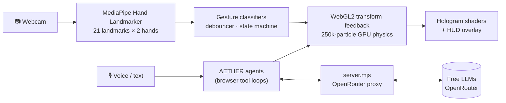

| Layer | Details |
|---|---|
| **Hand tracking** | [MediaPipe Hand Landmarker](https://ai.google.dev/edge/mediapipe/solutions/vision/hand_landmarker), GPU delegate with CPU fallback, fully on-device |
| **Gestures** | Pose classifiers, snap and repulsor detectors, hand twist/tilt, two-hand zoom, debouncer and state machine |
| **Particle engine** | Hand-written WebGL2. The physics runs on the GPU with transform feedback and is verified against a CPU twin to ~1e-7. No Three.js, no framework |
| **Hologram look** | Depth cueing, shimmer, scan band, interference lines, sparks, depth-faded globe and a projector cone |
| **Models** | Procedural geometry sampled area-correctly into point clouds, built in a Web Worker |
| **AI** | Core + 4 specialist agents with OpenAI-style tool calling via OpenRouter, a keyword router and an offline fallback |
| **Server** | Zero-dependency Node.js static server and API proxy (`server.mjs`) |

## ☁️ Deploy your own

[](https://vercel.com/new/clone?repository-url=https%3A%2F%2Fgithub.com%2Fsreekanthpogula%2FAETHER&env=OPENROUTER_API_KEY&envDescription=Free%20key%20from%20openrouter.ai%2Fkeys%20for%20the%20AI%20agents&envLink=https%3A%2F%2Fopenrouter.ai%2Fkeys&project-name=aether&repository-name=aether)

One click, or from your terminal:

```bash
npx vercel link
npx vercel env add OPENROUTER_API_KEY production   # paste your free OpenRouter key
npx vercel deploy --prod
```

The static app is built into `dist/` (`scripts/build.mjs` also copies in the MediaPipe runtime), and the brain runs as two
Vercel functions in `api/aether/` that share `lib/brain.mjs` with the local server.

> [!IMPORTANT]
> **Your key on a public URL.** The proxy only ever calls OpenRouter's `:free` models, so a deployment can't spend
> money. It also rejects cross-origin requests and caps the request size. To stop strangers using your free quota, set
> `AETHER_ACCESS_CODE` in Vercel: visitors then open the site once with `?code=YOUR_CODE` (remembered on that
> device). Everything else, including gestures, the hologram and the local-rules agents, still works without it.

## ⚙️ Configuration

**Environment** (in `.env`, see [`.env.example`](.env.example)):

| Variable | Default | Effect |
|---|---|---|
| `OPENROUTER_API_KEY` | none | Turns on the AI brain (`OPEN_ROUTER_KEY` also works) |
| `OPENROUTER_MODEL` | auto | Comma-separated models to try in order |
| `AETHER_ALLOW_LAN` | off | Let other devices on your network use the brain (local server) |
| `AETHER_ACCESS_CODE` | none | Require `?code=…` before a deployment's brain answers |
| `AETHER_ALLOW_PAID` | off | Allow non-`:free` models in `OPENROUTER_MODEL` (costs money) |
| `PORT` | `5173` | Server port (or `npm start -- 8080`) |

**URL options:**

| Option | Effect |
|---|---|
| `?n=250000` | Particle count (5k to 1M) |
| `?model=12` | Start on a given model |
| `?autostart=camera` / `nocamera` | Skip the start screen |
| `?holo=0` | Plain particle glow instead of the hologram look |
| `?address=sir` | What AETHER calls you |
| `?code=…` | Access code for a locked deployment |
| `?trails=0` / `?dpr=1` | Turn off trails / force the pixel ratio (for slower GPUs) |

## 🧪 Testing

45 end-to-end and unit tests with [Playwright](https://playwright.dev/). They drive the real app with synthetic hands
on a deterministic clock. No camera, network or API key is needed: OpenRouter and Wikipedia are mocked.

```bash
npx playwright install chromium   # one time
npm test
```

| Spec | Covers |
|---|---|
| `aether.spec.js` | Wake word and router, parallel agents with dots and cards, `@agent` tasks, Core→specialist delegation, error fallback, repulsor, Royal Enfield, 360° view |
| `app.spec.js` | The gesture story, every model, explode/assemble, keyboard, wheel, tabs, demo, phone layout |
| `features.spec.js` | Heartbeat, breathing, two-hand zoom, point-to-pick, pinch-to-pull, quiz, voice, cut-away, recording |
| `camera.spec.js` | Real `getUserMedia` to MediaPipe on Chromium's fake webcam, plus the camera-denied fallback |
| `gpu.spec.js` | The GPU physics shader matches its CPU twin to ~1e-7 in every mode |
| `logic.spec.js` · `models.spec.js` | Classifiers, state machine, voice parser; every model deterministic, finite, fast and correctly exploding |

**Regenerate the README media** (screenshots and the frame-perfect demo video):

```bash
npm run capture                      # screenshots + frames into docs/media
FFMPEG=/path/to/ffmpeg npm run capture   # also encodes demo.mp4 + demo.gif
```

## 📁 Project structure

```
index.html · styles.css      page, Stark-style HUD, AETHER console
server.mjs                   zero-dependency local server (static files + brain API)
lib/brain.mjs                OpenRouter proxy: free models only, fallback, guards (shared with Vercel)
api/aether/                  Vercel functions: POST /api/aether, GET /api/aether/status
vercel.json                  build, headers and function config for Vercel
src/app.js                   render loop, explode, zoom, 360° view, picking, quiz, HUD, agent UI
src/aether.js                Core orchestrator, parallel agent tool loops, local brain, weather, Wikipedia, sfx
src/agents.js                agent roles, tools, prompts and the keyword router
src/hands.js                 webcam + MediaPipe Hand Landmarker
src/features.js              voice commands, read-aloud, video recorder
src/gl/                      WebGL2 renderer and shaders (transform-feedback physics, hologram look)
src/logic/                   gestures, repulsor, state machine, controller, CPU physics twin
src/models/                  wonders, anatomy, biology, engines, vehicles, machines, stark, enfield
scripts/build.mjs            static build for Vercel (dist/ + vendor/mediapipe)
scripts/capture.mjs          regenerates the README screenshots and demo video
tests/                       Playwright specs
```

## 🗺️ Roadmap

- [x] Multi-agent orchestration with parallel specialists
- [x] Realistic hologram rendering and a full 360° view
- [x] Offline "local protocols" brain
- [ ] Streaming replies (speak while the agents are still working)
- [ ] Neural text-to-speech voices
- [ ] More agents: Maps, Calendar, Smart home
- [ ] WebXR: step into the hologram with a headset
- [ ] Import your own 3D models (glTF to point cloud)

Ideas and requests are welcome: [open an issue](https://github.com/sreekanthpogula/AETHER/issues).

## 🤝 Contributing

Contributions are welcome.

1. Fork the repo and create a branch: `git checkout -b feature/amazing-thing`
2. Make your change and add a test (`tests/` has helpers for synthetic hands and mocked agents)
3. Run `npm test` and make sure everything passes
4. Open a pull request with a short description and a screenshot if the change is visual

**New model?** Add a file in `src/models/` (see `enfield.js` for a fully labelled example) and register it in
`catalog.js`. **New agent tool?** Declare it in `src/agents.js` and implement it in `aetherTool()` in `src/app.js`.

## ❓ FAQ & troubleshooting

<details>
<summary><b>The camera doesn't start</b></summary>

Open the app via `http://localhost:5173`, not by double-clicking `index.html`, and allow camera access. Browsers only
allow the camera on `localhost` or `https`.
</details>

<details>
<summary><b>AETHER says "local protocols"</b></summary>

Check that `.env` has `OPENROUTER_API_KEY` and restart `npm start`. Free models are sometimes rate-limited; AETHER
then tries the next model, and falls back to local rules for that answer.
</details>

<details>
<summary><b>Voice commands don't work</b></summary>

Speech recognition works in Chrome and Edge. In other browsers, press <kbd>J</kbd> and type. For the British voice,
install an `en-GB` voice in your OS (on Windows, "Microsoft Ryan" or "George").
</details>

<details>
<summary><b>Low frame rate</b></summary>

Try `http://localhost:5173/?n=100000&dpr=1`, or `?holo=0` for the lighter plain-glow look.
</details>

<details>
<summary><b>Hand tracking never loads</b></summary>

Run `npm install` first: the tracking runtime is served from `node_modules`.
</details>

## 🙏 Acknowledgements

- Built on **[WonderSnap](https://github.com/AkbarSheikh-debug/wondersnap)** by Akbar Sheikh: the original gesture
  and particle engine.
- [MediaPipe](https://ai.google.dev/edge/mediapipe) for hand tracking, [OpenRouter](https://openrouter.ai) for free
  model access, [Open-Meteo](https://open-meteo.com) for weather and [Wikipedia](https://www.wikipedia.org) for
  knowledge.

<sub>Iron Man, J.A.R.V.I.S. and Stark Industries are trademarks of Marvel. Royal Enfield and Classic 350 are
trademarks of Royal Enfield (Eicher Motors). They're used here only to describe fan-made models; this project is not
affiliated with or endorsed by them.</sub>

## 📄 License

[MIT](LICENSE) © 2026 Akbar Sheikh (original WonderSnap) and AETHER contributors.

<div align="center">
<br>

**If AETHER made you smile, give it a ⭐. It helps others find it.**

<a href="https://star-history.com/#sreekanthpogula/AETHER&Date">
  
</a>

</div>
